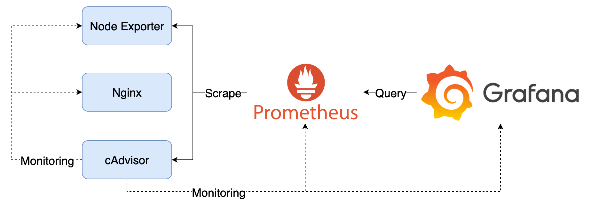

# Grafana 基礎操作



## Goals

此 Lab 會建立：

1. Nginx：單純作為被監測的 Container
2. cAdvisor：收集 Container 資料
3. Node Exporter：收集運行的機器（Node）的資料
4. Prometheus：採集 cAdvisor 與 Node Exporter 的 Metrics
5. Grafana：Lab 操作，並查詢與顯示 Prometheus 採集到的 Metrics

## Quick Start

1. 啟動所有服務

   ```bash
   docker-compose up -d
   ```

2. 檢視服務

   1. Grafana：[http://localhost:3000](http://localhost:3000)，登入帳號密碼為 `admin/admin`
      1. 點擊左上 Menu > Dashboards > Provision Dashboards 再選擇 Basic Dashboard、cAdvisor exporter 或 Node Exporter Full，即可看到預先建立的 Dashboard
   2. nginx：[http://localhost](http://localhost)，可以顯示 IP 與時間

3. 關閉所有服務

   ```bash
   docker-compose down
   ```

## Note

Grafana 資料會儲存在 `data` 目錄中，如果要將 Grafana 還原至初始狀態，可以將 `data` 目錄刪除。
