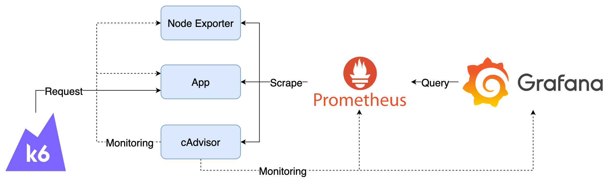

# Dashboard 與 Monitoring 的最佳實踐



## Components

1. K6：模擬使用者，持續發送 Request 至 App 
2. cAdvisor：收集 Container 資料，產生 Prometheus Metrics
3. Node Exporter：收集機器資料，產生 Prometheus Metrics
4. App：範例應用程式
5. Prometheus：爬取並儲存 Prometheus Metrics
6. Grafana：查詢 Prometheus 上的 Metrics

## Goals

1. 操作內建 Dashboard： Monitoring Best Practice、Cadvisor exporter 與 Node Exporter Full Dashboard

## Quick Start

1. 啟動所有服務

   ```bash
   docker-compose up -d
   ```

2. 檢視服務
   1. Grafana：[http://localhost:3000](http://localhost:3000)，登入帳號密碼為 `admin/admin`
      1. 點擊左上 Menu > Dashboards > Provision Dashboards 再選擇 Monitoring Best Practice、cAdvisor exporter 或 Node Exporter Full，即可看到預先建立的 Dashboard
   2. Application：[http://localhost:8000/docs](http://localhost:8000/docs)，可以查看 API 文件，並透過 Swagger UI 測試 API
3. 模擬發送 Request，預設啟動時會持續發送 10 分鐘，若要再次發送可重新啟動 k6 container

   ```bash
   docker-compose start k6
   ```

4. 關閉所有服務

   ```bash
   docker-compose down
   ```

## Note

Grafana 資料會儲存在 `data` 目錄中，如果要將 Grafana 還原至初始狀態，可以將 `data` 目錄刪除。
