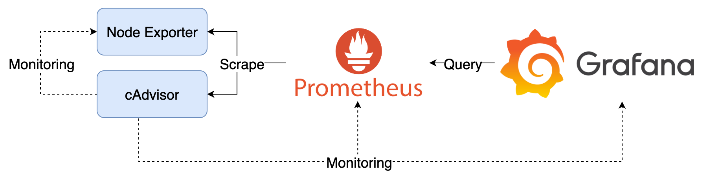

# Grafana Dashboard



## Components

1. cAdvisor：收集 Container 資料，產生 Prometheus Metrics
2. Node Exporter：收集機器資料，產生 Prometheus Metrics
3. Prometheus：爬取並儲存 Prometheus Metrics
4. Grafana：查詢 Prometheus 上的 Metrics

## Goals

1. 搭配內建的 TestData Data Source 操作各種 Visualization 的範例 Dashboard
   - 01 - Time Series
   - 02 - Stat, Gauge, Bar Gauge
   - 03 - State Timeline, Status History
   - 04 - Bar Chart, Pie Chart, Histogram, Heatmap
   - 05 - Table
   - 06 - Log, Node Graph, Traces, Flame Graph
   - 07 - Text
   - 08 - GeoMap
   - 09 - Canvas, Panel Plugins
   - 10 - Transform
   - 11 - Variables
   - Basic Dashboard
   - Cadvisor exporter
   - Node Exporter Full

## Quick Start

1. 啟動所有服務

   ```bash
   docker compose up -d
   ```

2. 檢視服務
   1. Grafana: [http://localhost:3000](http://localhost:3000)，登入帳號密碼為 `admin/admin`
      1. 點擊左上 Menu > Dashboards > Provision Dashboards 即可選擇預先建立的 Dashboard

3. 關閉所有服務

   ```bash
   docker compose down
   ```

## Note

Grafana 資料會儲存在 `data` 目錄中，如果要將 Grafana 還原至初始狀態，可以將 `data` 目錄刪除。
