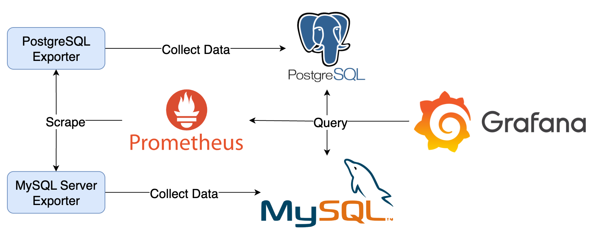

# DB Plugins



## Components

1. PostgreSQL Exporter：收集 PostgreSQL Server 資料，產生 Prometheus Metrics
2. PostgreSQL：供 Grafana 查詢
3. MySQL Server Exporter：收集 MySQL Server 資料，產生 Prometheus Metrics
4. MySQL：供 Grafana 查詢
5. Prometheus：爬取並儲存 Prometheus Metrics
6. Grafana：查詢 PostgreSQL 與 MySQL 資料，己及 Prometheus 上的 Metrics

## Goals

1. 查看預先建立好的 PostgreSQL 與 MySQL Data Source 設定方式
2. 操作 Explore 查閱預先建立好的 PostgreSQL 與 MySQL Data Source
3. 操作內建 Dashboard： DB Query、MySQL Exporter Quickstart and Dashboard 與 PostgreSQL Statistics

### Quick Start

1. 啟動所有服務

   ```bash
   docker compose up -d
   ```

2. 檢視服務
   1. Grafana: <http://localhost:3000>，登入帳號密碼為 `admin/admin`
      1. 點擊左上 Menu > Dashboards > Provision Dashboards 即可選擇預先建立的 Dashboard

3. 關閉所有服務

   ```bash
   docker compose down
   ```

## Note

Grafana 資料會儲存在 `data` 目錄中，如果要將 Grafana 還原至初始狀態，可以將 `data` 目錄刪除。
