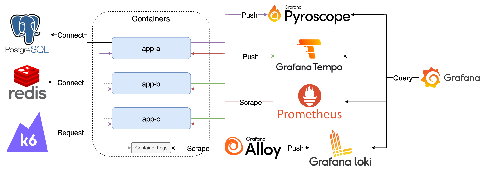

# Observability



## Components

1. K6：模擬使用者，持續發送 Request 至 App
2. PostgreSQL：供範例應用程式使用
3. Redis：供範例應用程式使用
4. App：範例應用程式，並提供 Prometheus Metrics
5. Pyroscope：接收並儲存 Profiles
6. Tempo：接收並儲存 Traces
7. Prometheus：爬取並儲存 Prometheus Metrics
8. Alloy：收集 Container Logs 轉送至 Loki
9. Loki：接收並儲存 Logs
10. Grafana：查詢 Pyroscope、Tempo、Prometheus 與 Loki 中的資料

## Goals

1. 檢視預先建立的 Pyroscope、Tempo、Prometheus 與 Loki Data Source 設定方式
2. 使用 Explore 功能查詢上述 Data Source 的資料
3. 體驗各類 Observability Signals 之間的交互連結
4. 操作內建的 FastAPI Observability Dashboard

## Quick Start

1. 啟動所有服務

   ```bash
   docker compose up -d
   ```

2. 檢視服務
   1. Grafana: <http://localhost:3000>，登入帳號密碼為 `admin/admin`
      1. 點擊左上 Menu > Dashboards > Provision Dashboards > FastAPI Observability

3. 模擬發送 Request，預設啟動時會持續發送 100 分鐘，若要再次發送可重新啟動 k6 container

   ```bash
   docker compose start k6
   ```

4. 關閉所有服務

   ```bash
   docker compose down
   ```
