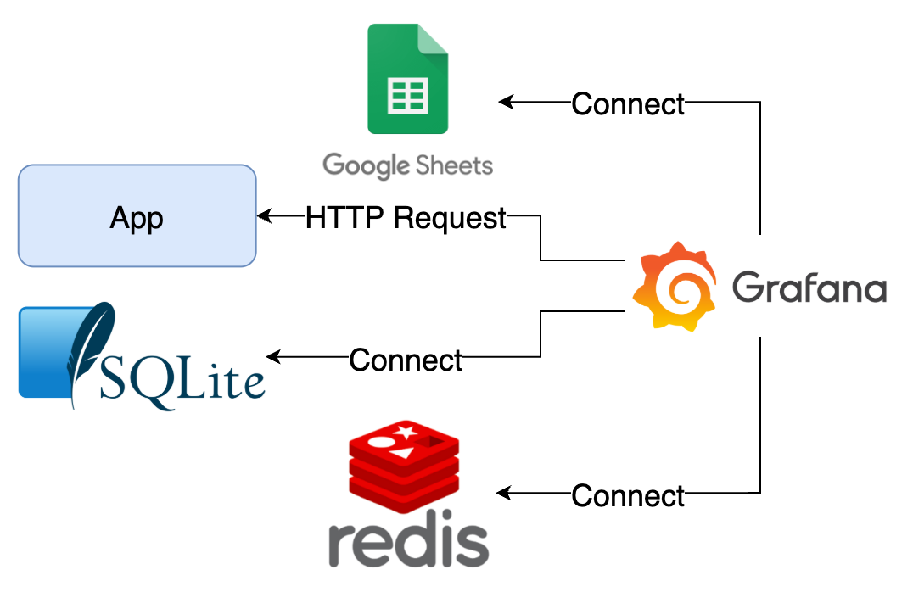

# Data Source Plugins



## Components

1. App：範例應用程式
2. SQLite：內建資料供查詢的 SQLite 檔
3. Redis：內建資料供查詢
4. Grafana：查詢 Google Sheet、App、SQLite 與 Redis 的資料

## Goals

1. 檢視預先建立的 Google Sheet、Infinity、SQLite 與 Redis Data Source 設定方式
2. Google Sheet Data Source 需設定自行申請的 API Key
3. 使用 Explore 功能查詢上述 Data Source 的資料
4. 操作內建 Dashboard： Plugins、Infinity

## Quick Start

1. 啟動所有服務

   ```bash
   docker compose up -d
   ```

2. 檢視服務
   1. Grafana: <http://localhost:3000>，登入帳號密碼為 `admin/admin`

3. 關閉所有服務

   ```bash
   docker compose down
   ```

## Note

Grafana 資料會儲存在 `data` 目錄中，如果要將 Grafana 還原至初始狀態，可以將 `data` 目錄刪除。
