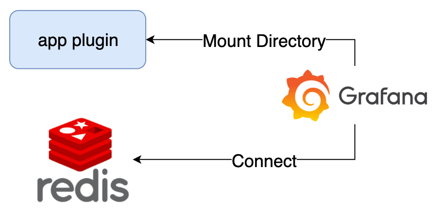
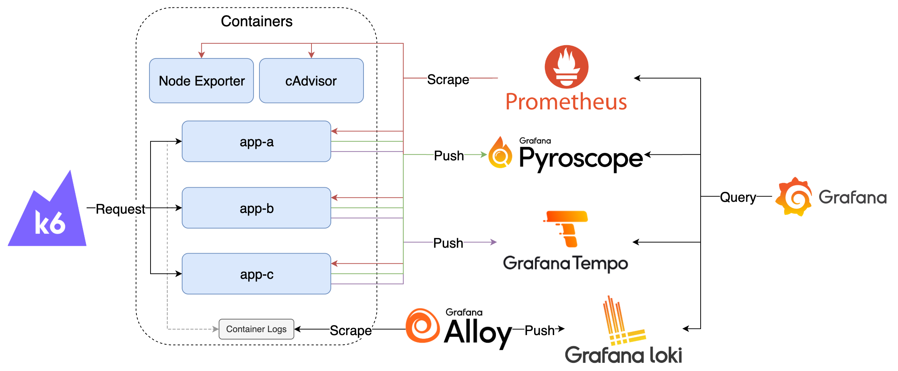

# Plugins

## App & Scenes



### Components

1. app plugin：Scenes 範例 App
2. Redis：內建資料供查詢
3. Grafana：查詢 Redis 的資料與

### Goals

1. 操作預先安裝的 Redis Application、Grafana Resources Exporter、Demo App

### Quick Start

1. 啟動所有服務

   ```bash
   docker compose up -d
   ```

2. 檢視服務
   1. Grafana: <http://localhost:3000>，登入帳號密碼為 `admin/admin`
      1. 點擊左上 Menu > Administration > Plugins and data > Plugins 搜尋 Redis Application、Resources Exporter、Demo-App 啟用
         1. 如果 Demo-App 沒有出現，請確認 compose 中的 app-plugin 已經執行完畢，並執行 `docker compose restart grafana` 重啟 Grafana 重新載入 Plugins
      2. 啟用後可以在 Menu 選單中看到 Apps  類別，可以再選擇想要查看的 Application

3. 關閉所有服務

   ```bash
   docker compose down
   ```

## Drilldown



### Components

1. K6：模擬使用者，持續發送 Request 至 App 
2. cAdvisor：收集 Container 資料，產生 Prometheus Metrics
3. Node Exporter：收集機器資料，產生 Prometheus Metrics
4. App：範例應用程式
5. Pyroscope：接收並儲存 Profiles
6. Tempo：接收並儲存 Traces
7. Prometheus：爬取並儲存 Prometheus Metrics
8. Alloy：收集 Container Logs 轉送至 Loki
9. Loki：接收並儲存 Logs
10. Grafana：查詢 Pyroscope、Tempo、Prometheus 與 Loki 中的資料

### Goals

1. 操作 Metrics、Logs、Traces、Profiles Drilldown

### Quick Start

1. 啟動所有服務

   ```bash
   docker compose -f docker-compose.drilldown.yaml up -d
   ```

2. 檢視服務
   1. Grafana: <http://localhost:3000>，登入帳號密碼為 `admin/admin`
      1. 點擊左上 Menu 選擇 Drilldown 測試各種 Drilldown 功能
      2. 若要使用 Profiles Drilldown 的 LLM 分析功能，需要在 LLM Plugin 的 Configuration 頁籤設定外部 LLM 服務的 URL 與 API Key

3. 模擬發送 Request，預設啟動時會持續發送 100 分鐘，若要再次發送可重新啟動 k6 container

   ```bash
   docker compose -f docker-compose.drilldown.yaml start k6
   ```

4. 關閉所有服務

   ```bash
   docker compose -f docker-compose.drilldown.yaml down
   ```
