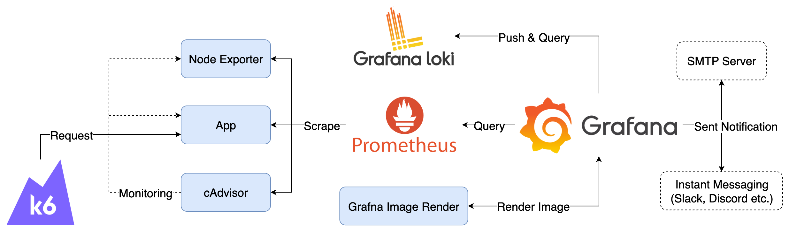

# Alert Rules



## Components

1. K6：模擬使用者，持續發送 Request 至 App 
2. cAdvisor：收集 Container 資料，產生 Prometheus Metrics
3. Node Exporter：收集機器資料，產生 Prometheus Metrics
4. App：範例應用程式
5. Prometheus：爬取並儲存 Prometheus Metrics
6. Loki：接收 Grafana 送出的 Alert Rules Log
7. Grafana：查詢 Prometheus 與 Loki 中的資料，執行 Alerting Rules
8. Grafana Image Renderer：搭配 Alerting 截取 Panel 圖片
9. SMTP Server：外部 SMTP Server，負責發送 Mail
10. Instant Messaging：外部訊息服務，如 Slack、Discord 或 Telegram

## Goals

1. 檢視預設的 Alert Rules 與 Contact Point
2. 瀏覽 Alert State History 與 Alerting History Page
3. 設定與測試 Mail、Slack、Discord 與 Telegram Contact Point

### Quick Start

1. 複製 `etc/grafana/grafana.ini.template` 為 `etc/grafana/grafana.ini` 並更新其中 smtp 的 username 與 password，password 需使用 Google Account 的應用程式密碼
2. 更新 `etc/grafana/alerting/contact-points.yaml` 中的 `example@email.com` 為自己的 Email
3. 啟動所有服務

   ```bash
   docker compose up -d
   ```

4. 檢視服務與 Alert 設定
   1. Grafana: <http://localhost:3000>，登入帳號密碼為 `admin/admin`
   2. 預先透過 Provisioning 設定的 Alert Rules、Contact Points、Notification Policies，無法直接從 UI 更改，但可以透過 Duplicate 或 View 檢視設定內容

5. 模擬發送 Request，預設啟動時會持續發送 100 分鐘，若要再次發送可重新啟動 k6 container

   ```bash
   docker compose start k6
   ```

6. 關閉所有服務

   ```bash
   docker compose down
   ```

## Note

Grafana 資料會儲存在 `data` 目錄中，如果要將 Grafana 還原至初始狀態，可以將 `data` 目錄刪除。
