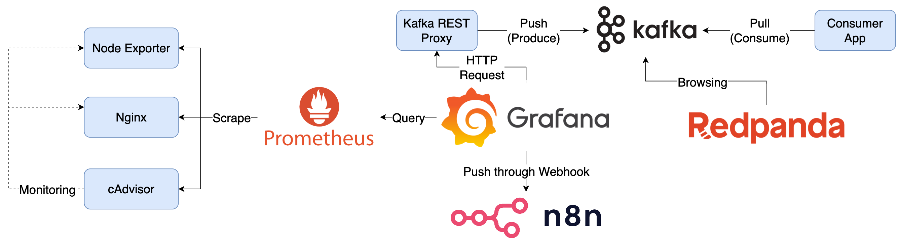

# Alert Rules



## Components

1. cAdvisor：收集 Container 資料，產生 Prometheus Metrics
2. Node Exporter：收集機器資料，產生 Prometheus Metrics
3. Nginx：範例應用程式
4. Prometheus：爬取並儲存 Prometheus Metrics
5. Grafana：查詢 Prometheus 中的資料，執行 Alerting Rules
6. Kafka REST Proxy：接收 HTTP Request 轉送至 Kafka
7. Kafka：訊息處理
8. Consumer App：訂閱 Kafka Topic 取得訊息，模擬下游服務
9. [Redpanda](https://github.com/redpanda-data/console)：以 Web UI 瀏覽 Kafka 內訊息與 Server 狀態
10. n8n：自動化流程工具，設定 Webhook 接收訊息

## Goals

1. 檢視預設的 Alert Rules 與 Contact Point
2. 瀏覽 Redpanda 與 Consumer App Container Log 驗證 Kafka 訊息傳遞結果
3. 設定 n8n Workflow 了解 Webhook 串接應用

### Quick Start

1. 啟動所有服務

   ```bash
   docker compose up -d
   ```

2. 設定 Contact Point 與測試 Alert
   1. Grafana: <http://localhost:3000>，登入帳號密碼為 `admin/admin`
   2. Webhook
      1. 登入 n8n: [http://localhost:5678](http://localhost:5678)，建立帳號與設定一組起點為 Webhook 的 Workflow
      2. 在 Grafana 建立 Webhook Contact Point，n8n 的 Webhook URL 在編輯時使用的是 `Test URL`，Workflow 啟用後用的 URL 是 `Production URL`，並將 n8n 提供的 URL Domain 從 `localhost` 改為 `n8n`，在 `Optional Webhook settings` 將 `HTTP Method` 設定為 `POST`
      3. 使用 Contact Point 的 `Test` 發送測試訊息驗證
      4. n8n 串接 Slack 可以在 [Credentials](https://docs.n8n.io/credentials/) 建立 Slack API 類型認證，使用 Slack App 的 `Bot User OAuth Token` 即可
   3. Kafka
      1. 使用預先建立的 `Kafka` Contact Point 的 `Test` 發送測試訊息驗證
      2. 開啟 Redpanda Console: <http://localhost:8080/> 在 Topic 頁籤中選擇 `grafana-alerting` Topic 查看測試訊息
      3. 檢視 Application 的 Container Log 查看 Topic 被訂閱後 Consume 印出的內容

3. 關閉所有服務

   ```bash
   docker compose down
   ```

## Note

Grafana 資料會儲存在 `data` 目錄中，如果要將 Grafana 還原至初始狀態，可以將 `data` 目錄刪除。

n8n 的資料會儲存在 `n8n` 目錄中，如果要將 n8n 還原至初始狀態，可以將 `n8n` 目錄刪除。
