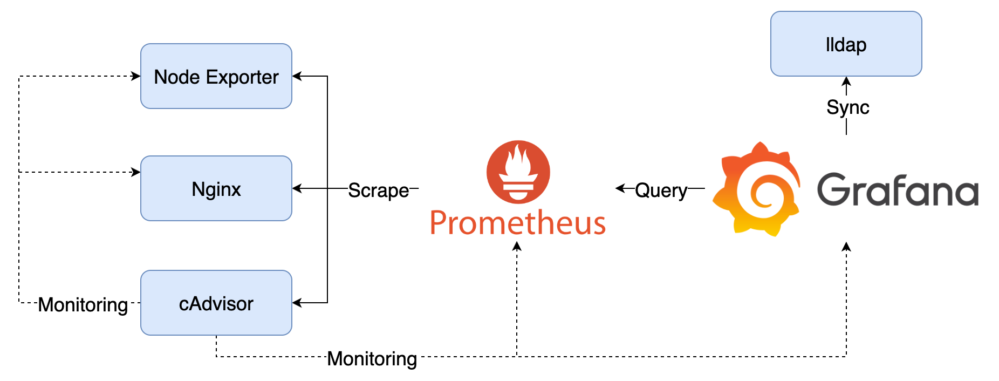

# User Management



## Components

1. cAdvisor：收集 Container 資料，產生 Prometheus Metrics
2. Node Exporter：收集機器資料，產生 Prometheus Metrics
3. Nginx：範例應用程式
4. Prometheus：爬取並儲存 Prometheus Metrics
5. lldap：簡易 LDAP Server
6. Grafana：查詢 Prometheus 中的資料，與 lldap 同步使用者資料

## Goals

1. 檢視預設的 LDAP 設定
2. 新增 User 與 Organization 並設定 Role、Team，了解權限管理相關功能

### Quick Start

1. 啟動所有服務

   ```bash
   docker compose up -d
   ```

2. 登入 lldap 建立 LDAP 帳號供 Grafana 串接登入使用
   1. lldap: <http://localhost:17170>，登入帳號密碼為 `admin/password`
   2. 建立數組帳號
   3. 建立 Group：`grafana_admin`、`grafana_editor`，並將前面建立的帳號加入 Group 中
3. 登入 Grafana 設定與操作各種權限設定
   1. Grafana: <http://localhost:3000>，登入帳號密碼為 `admin/admin`
   2. 進入 Administration > Authentication 頁籤中選擇 LDAP，確認 lldap 上新增的帳號可以被查詢到
   3. 開啟無痕視窗用 lldap 新增的帳號登入
   4. 測試 Role、Team、Organization 等功能
4. 關閉所有服務

   ```bash
   docker compose down
   ```

## Note

Grafana 資料會儲存在 `data` 目錄中，如果要將 Grafana 還原至初始狀態，可以將 `data` 目錄刪除。

lldap 的資料會儲存在 `lldap_data` 目錄中，如果要將 lldap 還原至初始狀態，可以將 `lldap_data` 目錄刪除。
