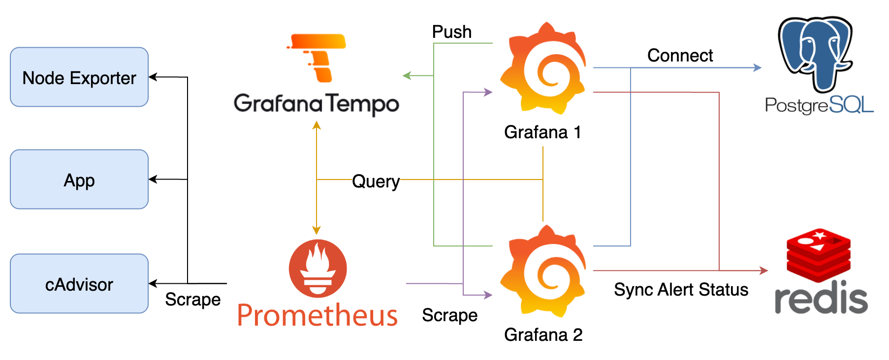

# Grafana Self Monitoring and High Availability



## Components

1. cAdvisor：收集 Container 資料，產生 Prometheus Metrics
2. Node Exporter：收集機器資料，產生 Prometheus Metrics
3. App：範例應用程式
4. Prometheus：爬取並儲存 Prometheus Metrics
5. Tempo：接收 Grafana 送出的 Trace 資料
6. Grafana：查詢 Prometheus 與 Tempo 中的資料，Alerting Rules 處理
7. PostgreSQL：不同 Grafana Instance 共用的資料庫
8. Redis：供不同 Grafana Instance 同步 Alert 發送狀態

## Goals

1. 檢視與驗證不同 Grafana Instance 共用資料庫的設定與效果
2. 使用 Explore 查看 Grafana 產生的 Trace 資訊與 Service Graph
3. 設定能夠發送訊息的 Contact Point，驗證不同 Grafana Instance 同步 Alert 發送狀態效果
4. 操作內建 Dashboard：Grafana Stats、Cadvisor exporter 與 Node Exporter Full Dashboard

### Quick Start

1. 啟動所有服務

   ```bash
   docker compose up -d
   ```

2. 登入 Grafana 操作 Dashboard、Explore 功能與測試 Alert 是否有 HA 架構及不會重複發送
   1. Grafana: <http://localhost>，登入帳號密碼為 `admin/admin`
   2. 點擊左上 Menu > Dashboards > Provision Dashboards 查看 Grafana Stats 多個 Grafana Instance 的狀態
   3. 使用 Explore 查看 Grafana 產生的 Trace 資訊
   4. 停止一個 Grafana Container，確認 Grafana 仍可以正常檢視與發送 Alert
3. 關閉所有服務並清除 Data Volume

   ```bash
   docker compose down -v
   ```

## 參考資料

1. [Grafana alerting high availability examples](https://github.com/grafana/alerting-ha-docker-examples/tree/main)
