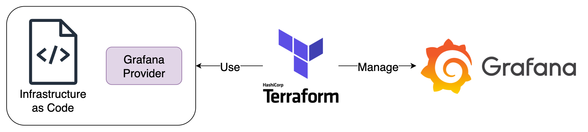

# Grafana Infrastructure as Code



## Components

1. Terraform：使用 IaC Code 建立與管理 Grafana 內資源
2. Grafana：由 Terraform 管理的 Grafana Instance

## Goals

1. 操作 Terraform 建立與管理 Grafana 內資源

### Quick Start

1. 啟動所有服務

   ```bash
   docker compose up -d
   ```

2. [安裝 Terraform CLI](https://developer.hashicorp.com/terraform/tutorials/aws-get-started/install-cli)，進入 `tf` 目錄執行以下指令

   ```bash
   # 下載 Grafana Provider 與 Terraform 初始化
   terraform init
   # Apply main.tf 中預先定義好的各種 Grafana 資源
   terraform apply
   ```

3. 登入 Grafana，驗證 `tf/main.tf` 中的 User、Folder、Dashboard、Alert 是否建立完成，並測試 Grafana API
   1. Grafana: <http://localhost:3000>，登入帳號密碼為 `admin/admin`
   2. 進入 Grafana 的 Swagger UI <http://localhost:3000/swagger> 測試各種 API

4. 關閉所有服務並清除 Data Volume

   ```bash
   docker compose down -v
   ```
