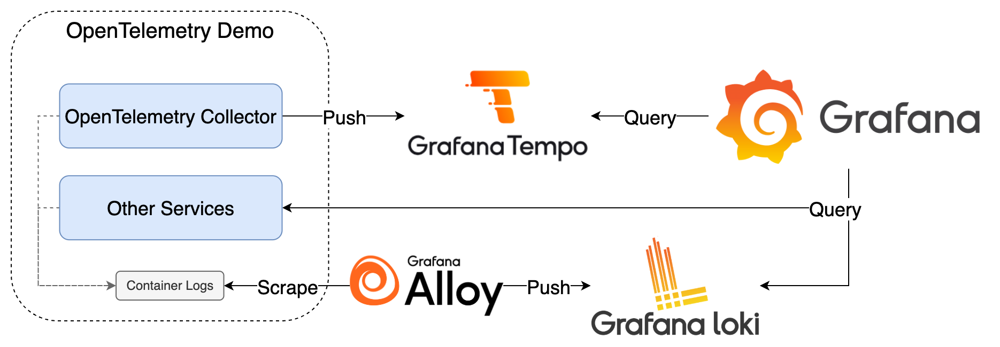
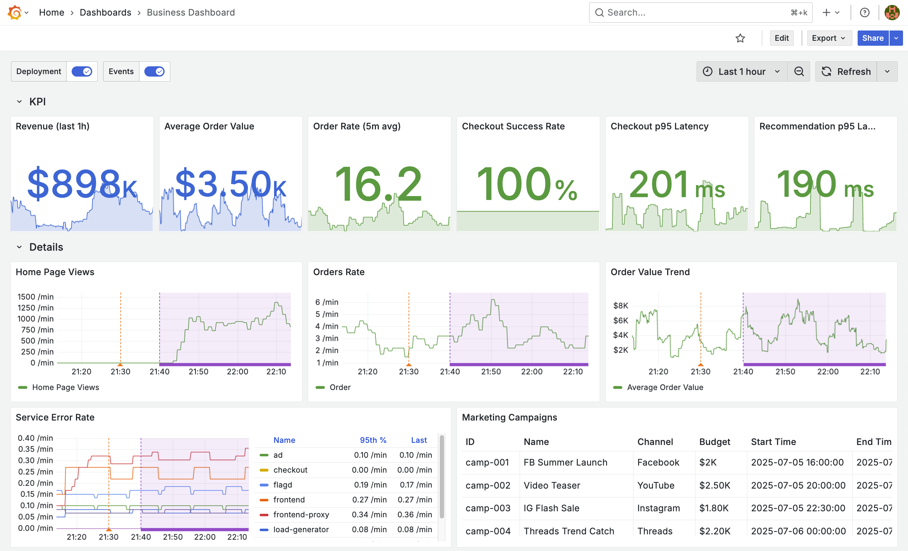

# Business Dashboard



此範例基於 [OpenTelemetry Demo](https://opentelemetry.io/docs/demo/) 服務設計，並同時呈現商業指標與技術監控的 Dashboard，專案架構沿用 [docker-compose.minimal.yml](https://github.com/open-telemetry/opentelemetry-demo/blob/6eea83882034747064fa28b3e7cefb361e6d5a31/docker-compose.minimal.yml) 檔案。

此目錄下除額外加入的 Tempo、Alloy、Loki 與 Grafana 設定和 Business Dashboard 外，其餘程式碼皆源於 [OpenTelemetry Demo](https://github.com/open-telemetry/opentelemetry-demo) 專案。

## Components

1. OpenTelemetry Deme：OpenTelemetry 應用程式範例組合
2. Tempo：接收並儲存 Traces
3. Alloy：收集 Container Logs 轉送至 Loki
4. Loki：接收並儲存 Logs
5. Grafana：查詢 Tempo 與 Loki 中的資料

## Goals

1. 了解 Annotation 使用方式
2. 檢視與學習如何設計 Business Dashboard



## Quick Start

1. 啟動所有服務

   ```bash
   docker compose up -d
   ```

2. 檢視服務
   1. Grafana: <http://localhost:8080/grafana/>，登入帳號密碼為 `admin/admin`
      1. 點擊左上 Menu > Dashboards > Provision Dashboards 即可選擇預先建立的 Business Dashboard
   2. OpenTelemetry Demo UI: <http://localhost:8080>
      1. OpenTelemetry Demo 前端網頁，可以操作模擬訂單服務
   3. Feature Flags: <http://localhost:8080/feature>
      1. Feature Flags 介面，調整後可以改變服務行為，例如增加流量、錯誤率等
   4. Jaeger: <http://localhost:8080/jaeger/ui>
      1. Jaeger UI，提供 Trace 查詢功能
   5. Load Generator: <http://localhost:8080/loadgen/>
      1. 模擬流量的 [Locust](https://locust.io/) 的 UI，可以查看與設定模擬流量
3. Annotation 測試
   1. 執行 Script 模擬服務部署與並建立 Deployment Annotation，在 Business Dashboard 中查看部署與服務狀態的關聯
      1. 執行 `bash deploy-simulation-01.sh`，建立 `First Deployment` Annotation，並將 Payment 失敗率設定為 75%
      2. 執行 `bash deploy-simulation-02.sh`，建立 `Second Deployment` Annotation，並將 Payment 失敗率設定為 0%
   2. 調整 `etc/csv/campaign.csv` 中的日期為當天日期與時間（UTC）後，重新整理 Business Dashboard 後會顯示對應的 Event Annotation，透過上方的 Event 開關可以選擇性顯示
4. 關閉所有服務並清除 Data Volume

   ```bash
   docker compose down -v
   ```

## Reference

1. [OpenTelemetry Demo](https://opentelemetry.io/docs/demo/)
