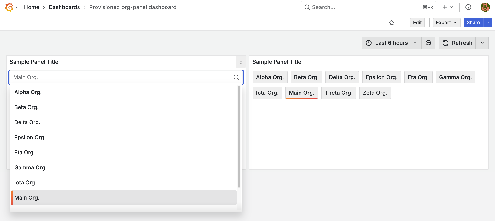

# Organization Panel Plugin

此 Lab 為簡化版的 Panel Plugin 範例專案，使用 [@grafana/create-plugin](https://github.com/grafana/plugin-tools/tree/main/packages/create-plugin) 模版建立，完整版的 Plugin 可參考 [Organization Panel](https://github.com/blueswen/grafana-organization-panel)。

專案受 [Organisations Panel](https://grafana.com/grafana/plugins/timomyl-organisations-panel/) 與 [Business Variable Panel](https://grafana.com/grafana/plugins/volkovlabs-variable-panel/) 啟發。

## Goals

1. 檢視 [@grafana/create-plugin](https://github.com/grafana/plugin-tools/tree/main/packages/create-plugin) 建立的 Plugin 基礎樣板與範例 Plugin，並使用開發用 Grafana 驗證 Plugin 內容
2. 使用 [@grafana/sign-plugin](https://github.com/grafana/plugin-tools/tree/main/packages/sign-plugin) 簽發 Plugin 憑證



## Quick Start

Node.js 版本需為 20.8.7 以上。

1. 安裝 Dependencies

   ```bash
   npm install
   ```

2. 編譯 Plugin 並以 watch 模式運行，異動時自動重新編譯

   ```bash
   npm run dev
   ```

3. 啟動開發用 Grafana，並建立測試用的 Organization

   ```bash
   docker compose up -d
   bash tests/create_org.sh
   ```

4. 進入 Grafana: <http://localhost:3000>，並登入 admin 帳號，帳號密碼為 `admin/admin`，檢視 `Provisioned org-panel dashboard` Dashboard，確認 Panel Plugin 是否正常運作。

5. 關閉 Grafana

   ```bash
   docker compose down
   ```
