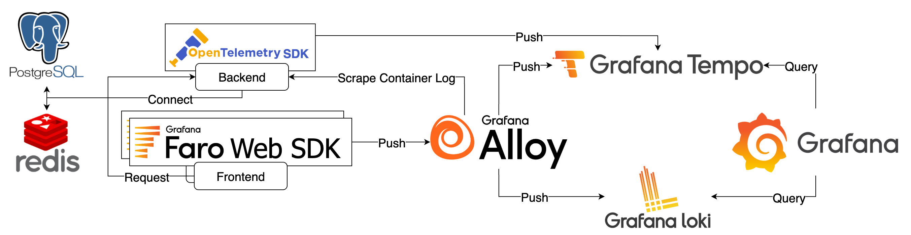
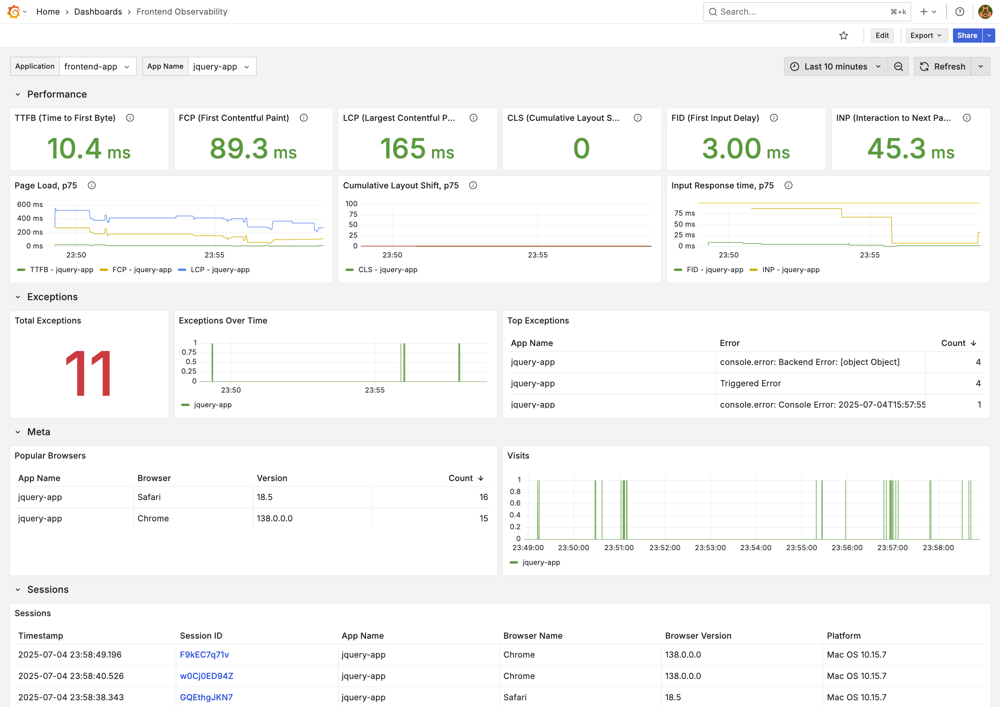
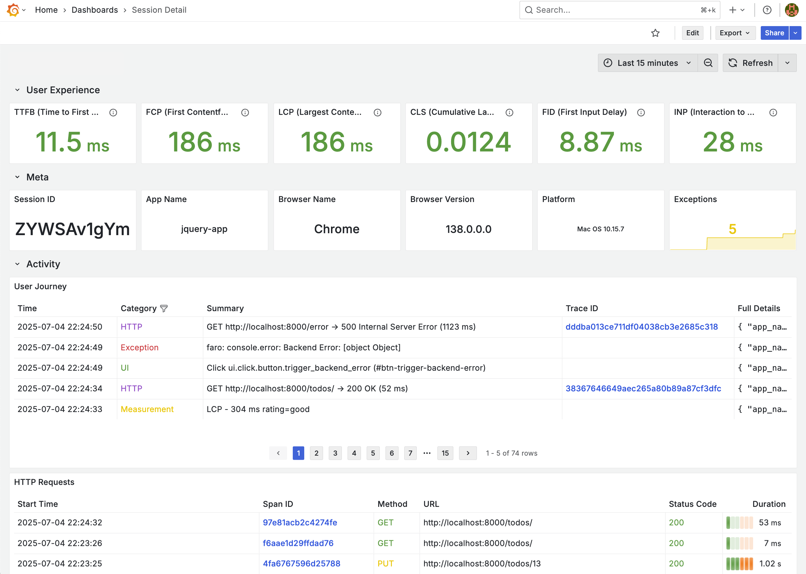

# Frontend Observability



## Components

1. Backend：範例應用程式，搭配 OpenTelemetry SDK 產生 Trace 資訊
2. PostgreSQL：供 Backend 使用
3. Redis：供 Backend 使用
4. Frontend：分有 Vue 與 jQuery 兩版，搭配 Faro Web SDK 監控前端事件
5. Alloy：接收 Faro Web SDK 前端事件，轉送至 Tempo 或 Loki；收集 Container Logs 轉送至 Loki
6. Tempo：接收並儲存 Traces
7. Loki：接收並儲存 Logs
8. Grafana：查詢 Tempo 與 Loki 中的資料

## Goals

1. 操作前端 App 後檢視內建的 Frontend Observability 與 Session Detail Dashboard





Dashboard 參考 [Grafana Faro - Frontend Monitoring](https://grafana.com/grafana/dashboards/17766-frontend-monitoring/) 與 [Grafana Cloud Frontend Observability](https://grafana.com/products/cloud/frontend-observability-for-real-user-monitoring/) 設計而成。

## Quick Start

1. 啟動所有服務

   ```bash
   docker compose up -d
   ```

2. 檢視服務
   1. 操作前端網頁，產生前端事件
      1. Vue 版：[http://localhost:8080](http://localhost:8080)
      2. jQuery 版：[http://localhost](http://localhost)
   2. Grafana：[http://localhost:3000](http://localhost:3000)，登入帳號密碼為 `admin/admin`
      1. 點擊左上 Menu > Dashboards > Provision Dashboards 瀏覽 Frontend Observability
      2. Frontend Observability 下方 Sessions 可以連結至 Session Detail Dashboard
3. 關閉所有服務

   ```bash
   docker compose down
   ```

## Note

Grafana 資料會儲存在 `data` 目錄中，如果要將 Grafana 還原至初始狀態，可以將 `data` 目錄刪除。

## Reference

1. [Grafana Faro - Frontend Monitoring](https://grafana.com/grafana/dashboards/17766-frontend-monitoring/)
