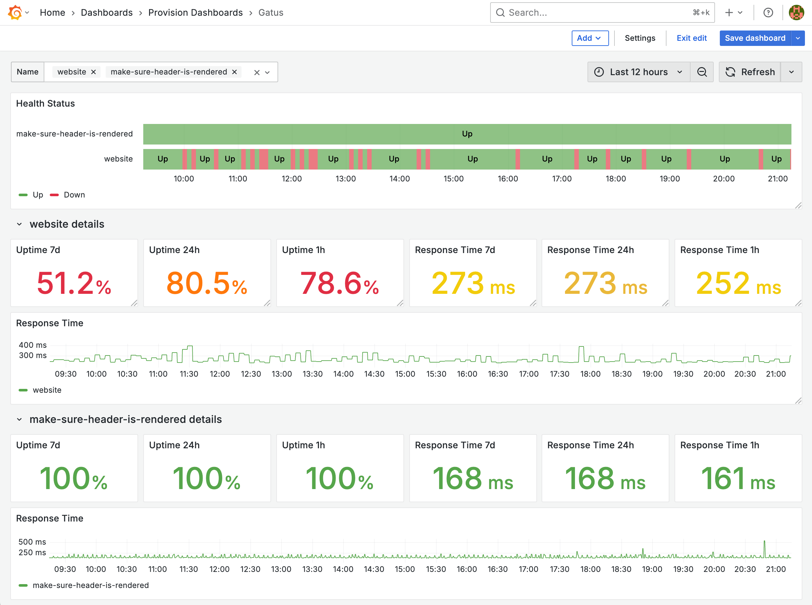

# Gatus


## Components

1. [Gatus](https://github.com/TwiN/gatus)：定期執行偵測並提供 Prometheus Metrics
2. Prometheus：爬取並儲存 Prometheus Metrics
3. Grafana：查詢 Prometheus 中的資料

## Goals

1. 檢視與學習如何設計 Gatus Dashboard



## Quick Start

1. 啟動所有服務

   ```bash
   docker compose up -d
   ```

2. 檢視服務
   1. Gatus: <http://localhost:8080>，檢視 Gatuts Status Page
   2. Grafana: <http://localhost:3000>，登入帳號密碼為 `admin/admin`
      1. 點擊左上 Menu > Dashboards > Provision Dashboards 即可選擇預先建立的 Dashboard
3. 關閉所有服務並清除 Data Volume

   ```bash
   docker compose down -v
   ```
