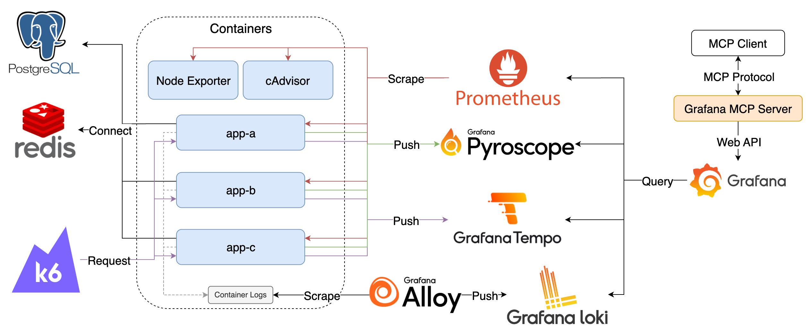

# Grafana with LLM



## Components

1. K6：模擬使用者，持續發送 Request 至 App 
2. cAdvisor：收集 Container 資料，產生 Prometheus Metrics
3. Node Exporter：收集機器資料，產生 Prometheus Metrics
4. App：範例應用程式
5. PostgreSQL：供 App 使用
6. Redis：供 App 使用
7. Pyroscope：接收並儲存 Profiles
8. Tempo：接收並儲存 Traces
9. Prometheus：爬取並儲存 Prometheus Metrics
10. Alloy：收集 Container Logs 轉送至 Loki
11. Loki：接收並儲存 Logs
12. Grafana：查詢 Pyroscope、Tempo、Prometheus 與 Loki 中的資料，並配置 Alert Rules

## Goals

1. 使用 Grafana MCP Server 查詢 Grafana 上的各類資料與管理 Dashboard

## Quick Start

1. 啟動所有服務

   ```bash
   docker compose up -d
   ```

2. 檢視服務
   1. Grafana: <http://localhost:3000>，登入帳號密碼為 `admin/admin`
      1. 點擊左上 Menu > Administration > Users and access > Service accounts，建立 Admin 角色的 Service Account，並建立 Token 供 MCP Server 使用
   2. 在支援 MCP Server 的 LLM Agent 中設定 Grafana MCP Server，如 [Claude Desktop](https://modelcontextprotocol.io/quickstart/user)、[GitHub Copilot](https://docs.github.com/en/copilot/how-tos/context/model-context-protocol/extending-copilot-chat-with-mcp) 或 [Gemini CLI](https://cloud.google.com/gemini/docs/codeassist/use-agentic-chat-pair-programmer#configure-mcp-servers) 都有支援
      
      ```json
      {
        "mcpServers": {
            "grafana": {
            "command": "docker",
            "args": [
                "run", "--rm", "-i", "-e", "GRAFANA_URL", "-e", "GRAFANA_API_KEY",
            "--add-host=host.docker.internal:host-gateway", "mcp/grafana", "-t", "stdio"
            ],
            "env": {
                "GRAFANA_URL": "http://host.docker.internal:3000",
                "GRAFANA_API_KEY": "<your service account token>"
            }
            }
        }
      }
      ```

   3. 使用 LLM Agent 操作 Grafana，例如建立 Dashboard、查詢 Metrics 或 Alert 等。

3. 模擬發送 Request，預設啟動時會持續發送 100 分鐘，若要再次發送可重新啟動 k6 container

   ```bash
   docker compose start k6
   ```

4. 關閉所有服務

   ```bash
   docker compose down
   ```

## Note

Grafana 資料會儲存在 `data` 目錄中，如果要將 Grafana 還原至初始狀態，可以將 `data` 目錄刪除。
