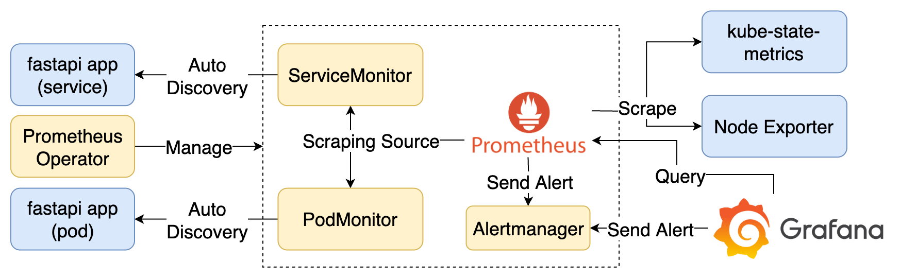

# Kube Prometheus Stack



## Contents

1. fastapi：範例應用程式
2. Exporters：收集機器、Container、Kubernetes 資料，產生 Prometheus Metrics
3. Prometheus：爬取並儲存 Prometheus Metrics
4. Prometheus Alertmanager：根據告警規則發送通知
5. Grafana：預查詢 Prometheus 上的 Metrics
6. Prometheus Operator：管理 Prometheus 相關資源

## Goals

1. 使用[kube-prometheus-stack](https://github.com/prometheus-community/helm-charts/tree/main/charts/kube-prometheus-stack) Helm Chart 建立完整的監控機制組合
2. 操作與檢視 kube-prometheus-stack 匯入的 Dashboard、Alert Rules

## Quick Start

### Kubernetes with k3d

[k3d](https://k3d.io/) 用於快速建立 Kubernetes 環境，適合用於開發與測試。

```bash
# 根據 k3d/conf.yaml 建立 k3d cluster
k3d cluster create --config k3d/conf.yaml

# 確認 Kubernetes cluster 已建立
kubectl get node

# 停止 k3d cluster
k3d cluster stop kube-prom-stack-lab

# 清除 k3d cluster
k3d cluster delete kube-prom-stack-lab
```

### kube-prometheus-stack

#### Install

使用 Helm 安裝 kube-prometheus-stack，並使用 `values.yaml` 設定額外的 Prometheus 參數。

```bash
helm repo add prometheus-community https://prometheus-community.github.io/helm-charts
helm repo update
helm upgrade --install prometheus-community prometheus-community/kube-prometheus-stack --version 75.6.1 --namespace monitoring --create-namespace -f values.yaml
```

#### Usage

使用 `kubectl port-forward` 進入 Grafana(<localhost:3000>) 與 Prometheus(<localhost:9090>)，並檢視匯入的 Dashboard 與 Alert Rules。

```bash
# 取得 Grafana 的登入密碼
kubectl get secret prometheus-community-grafana -n monitoring -o jsonpath="{.data.admin-password}" | base64 --decode ; echo
# 建立 Port Forward 進入 Grafana，檢視匯入的 Dashboard 與 Alert Rules
kubectl port-forward -n monitoring svc/prometheus-community-grafana 3000:80

# 建立 Port Forward 進入 Prometheus，檢視爬取 Metrics 的 Targets
kubectl port-forward -n monitoring svc/prometheus-community-kube-prometheus 9090:9090
```

#### Application Monitoring

app.yaml 中定義了要被監控的 FastAPI Application，透過 Prometheus Operator 的 ServiceMonitor 與 PodMonitor 來收集 Metrics。可於 Prometheus 的 Targets 頁面確認 Application 是否有被自動加入爬取清單，並於 Grafana 中檢視額外爬取的 fastapi 開頭 Metrics。

```bash
# 部署被監控的 FastAPI Application
kubectl apply -f app.yaml

# 建立 Port Forward 進入 FastAPI Application
kubectl port-forward svc/fastapi 8000:8000

# 執行 k6 發送 Request 到 FastAPI Application
k6 run --vus 3 --duration 6000s k6-script.js
```
