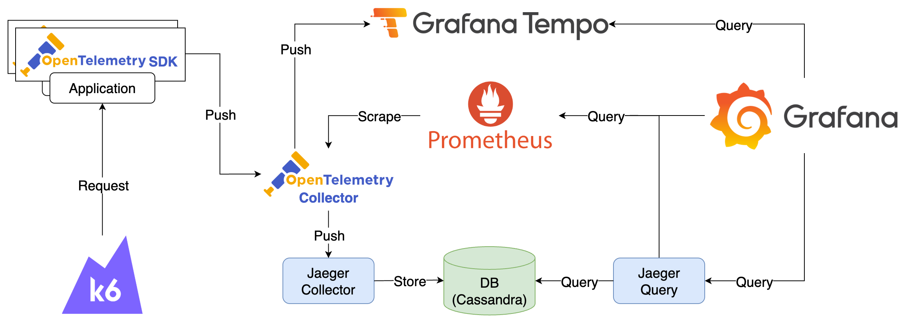

# Service Performance Monitoring



## Components

1. Applications：各種搭配 OpenTelemetry SDK 的服務，透過 [Zero-code Instrumentation](https://opentelemetry.io/docs/zero-code/) 自動生成與發送 Trace 資訊到 OpenTelemetry Collector
   1. fastapi：Python FastAPI 服務
   2. spring-boot：Java Spring Boot 服務
   3. express：Node.js Express 服務
2. k6：使用 [k6](https://k6.io/) 持續對 Applications 發送 Request
3. OpenTelemetry Collector
   1. 接收 Traces 資料，將 Traces 資料轉送至 Jaeger Collector 與 Tempo，並透過 Span Metrics Connector 產生 Metrics
   2. 接收 Span Metrics Connector 產生的 Metrics 資料，並揭露於自己的 8889 Port 供 Prometheus 爬取
4. Tempo：接收 OpenTelemetry Collector 發送的 Traces 資料
5. Prometheus：採集 OpenTelemetry Collector 的 Metrics
6. Jaeger Components
   1. Jaeger Collector：接收 OpenTelemetry Collector 發送的 Traces 資料
   2. Jaeger Query：提供 UI 查看 Trace Data，並從 Prometheus 取得 Metrics 資料供 Jaeger SPM 使用
   3. Cassandra：儲存 Trace Data
   4. Cassandra Schema：初始化 Cassandra DB
7. Grafana：內建範例 Service Performance Monitoring Dashboard 與 Prometheus、Tempo、Jaeger Data Source

## Goals

1. 使用 Explore 功能查詢 Prometheus、Tempo、Jaeger Data Source 的資料
2. 檢視與學習如何設計 Service Performance Monitoring Dashboard


## Quick Start

1. 啟動所有服務

   ```bash
   docker compose up -d
   ```

2. 檢視服務
   1. Grafana: <http://localhost:3000>，登入帳號密碼為 `admin/admin`
      1. 點擊左上 Menu > Dashboards > Provision Dashboards 即可選擇預先建立的 Service Performance Monitoring Dashboard
   2. Jaeger Query: <http://localhost:16686/monitor>
      1. Jaeger Query 需要等待 Cassandra 初始化完成後才能正常運作
3. 模擬發送 Request，預設啟動時會持續發送 100 分鐘，若要再次發送可重新啟動 k6 container

   ```bash
   docker compose start k6
   ```

4. 關閉所有服務

   ```bash
   docker compose down
   ```

## Note

Grafana 資料會儲存在 `data` 目錄中，如果要將 Grafana 還原至初始狀態，可以將 `data` 目錄刪除。

## Reference

1. [OpenTelemetry Application Performance Management](https://github.com/blueswen/opentelemetry-apm)
2. [Span Metrics — OpenTelemetry Collector 的 Trace 鍊金術](https://ithelp.ithome.com.tw/articles/10336986)
